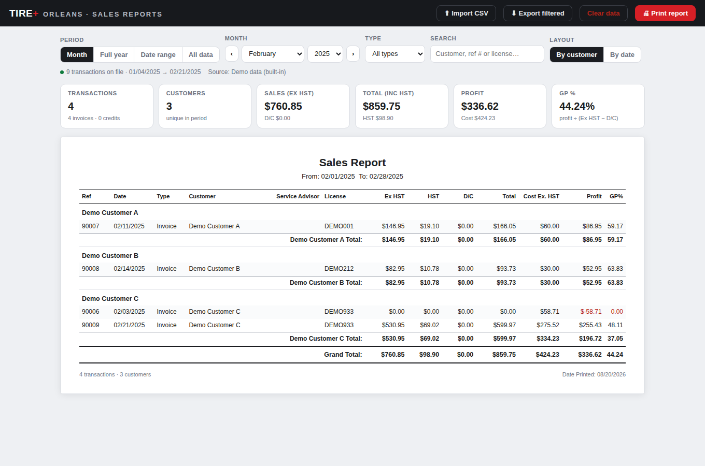

# TIRE+ Orleans — Sales Reports

A local, single-file web app for filtering and printing monthly (or any-period)
historical sales reports from the point-of-sale **Sales Report** CSV export.
The printed output follows the same layout as the system's own PDF report:
transactions grouped alphabetically by customer, a subtotal per customer, and a
grand total, with the columns
`Ref · Date · Type · Customer · Service Advisor · License · Ex HST · HST · D/C · Total · Cost Ex. HST · Profit · GP%`.

*Screenshot uses the built-in fictional demo data.*

## Quick start

1. Get `index.html` onto your computer (clone this repo, or download just that
   one file). No installation, no server, no internet needed.
2. Double-click `index.html` — it opens in your browser (Chrome or Edge
   recommended for printing).
3. Drag & drop your **Sales Report CSV export** onto the page (or click
   *Import CSV*). The raw export works as-is — the app automatically skips the
   title block, repeated page headers, subtotal rows and "Page x of y" lines,
   and keeps only the actual invoice/credit rows.
4. Pick a month (or a full year, a custom date range, or all data), optionally
   narrow by customer/ref/license search or by type (invoices vs credits).
5. Click **Print report**. In the print dialog you can send it to a printer or
   *Save as PDF*.

To try it without real data, click *"…or try it with built-in demo data"* on
the start screen, or import [`sample-data/demo-sales-report.csv`](sample-data/demo-sales-report.csv).

## Features

- **Period filters** — month picker with ‹ › navigation, full year, custom
  date range, or everything on file.
- **Search** — by customer name, ref (invoice #) or license plate.
- **Type filter** — all types, invoices only, or credits only.
- **Two layouts** — grouped by customer with subtotals (like the original
  report) or a flat chronological list.
- **Summary cards** — transactions, unique customers, sales ex HST, total inc
  HST, profit and GP% for the current selection.
- **Print-ready** — A4 layout, column headers repeat on every page, customer
  groups are kept together where possible, and the browser tab title is set so
  *Save as PDF* suggests a sensible file name (e.g. `Sales Report — January 2025`).
- **Multi-year history** — import several exports (e.g. 2024 and 2025);
  transactions merge by ref, so re-importing the same or overlapping exports
  never creates duplicates (the newest import wins).
- **Export filtered** — download whatever is currently selected as a clean,
  spreadsheet-friendly CSV.
- **Remembers your data** — imports are stored in the browser's local storage,
  so the report is ready next time you open the page. *Clear data* removes
  everything.

## How the numbers are computed

The app re-computes every subtotal and total from the raw rows rather than
trusting the export's own summary lines:

- `Total = Ex HST + HST − D/C`
- `Profit = Ex HST − D/C − Cost Ex. HST`
- `GP% = Profit ÷ (Ex HST − D/C) × 100` (shown as `0.00` when the denominator is zero)

These formulas were verified against the source system: the app's grand totals
match the export's own grand-total row and the sample monthly PDF report to
the cent.

## Privacy

- **Everything stays on your machine.** The app makes no network requests;
  imported data lives only in your browser's local storage.
- **This repository is public — never commit real sales exports.** They contain
  customer names, license plates and financials. `.gitignore` blocks
  `Sales_Report*.csv` and the `data/` folder as a safety net; keep your real
  exports there or outside the repo entirely. Only the fictional
  `sample-data/` file is tracked.

## Printing tips

- Chrome/Edge print dialog → *Margins: Default* and *Scale: Default* work well
  with the built-in A4 layout.
- Enable *"Headers and footers"* in the print dialog if you want page numbers
  and the date on every page (the report itself shows "Date Printed" and the
  transaction count at the end).
- Landscape is unnecessary — the layout is designed for portrait.

## Troubleshooting

- **"No sales rows found…"** — the file isn't a Sales Report CSV export (the
  app looks for rows with a numeric ref and a date, using either the export's
  known column layout or a header row with `Ref`, `Date`, `Customer`, …).
- **"…too large to remember between visits"** — the data exceeded the
  browser's local-storage quota. The report still works for the current
  session; re-import the CSV next time, or import fewer years at once.
