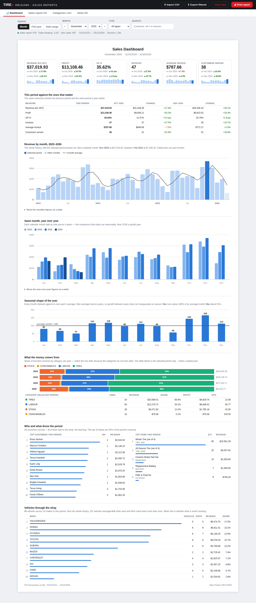

# TIRE+ Orleans — Sales Reports

A local, single-file web app for filtering and printing historical sales
reports from the point-of-sale CSV exports. It reads all three Workshop
exports and turns each into a filterable, print-ready report:

| Tab | Source export | What it shows |
| --- | --- | --- |
| **Dashboard** | (all three) | Trends, month-over-month and year-over-year comparisons, seasonality, category mix, top customers, items and vehicles |
| **Sales report** | Sales Report | Invoices/credits grouped by customer, with subtotals and a grand total — the same layout as the system's own PDF |
| **Categories** | Sales Breakup Report | Every line item grouped by category (Labour, Stock, Tires, Consumables, Sublet Repair) with per-category totals and GP% |
| **Items** | Item Sales Report | Per-product sales rolled up by item code: units sold, revenue, cost, profit and margin |

*Screenshot uses the built-in fictional demo data — no real customers.*

## Quick start

1. Get `index.html` onto your computer (clone this repo, or download just that
   one file). No installation, no server, no internet needed.
2. Double-click `index.html` — it opens in your browser (Chrome or Edge
   recommended for printing).
3. Drag & drop your **CSV exports** onto the page (or click *Import CSV*). You
   can drop all of them at once — each file's type is detected automatically,
   and the raw exports work as-is: the app skips title blocks, repeated page
   headers, subtotal rows and "Page x of y" lines.

   Two families of file are understood, and they can be mixed freely:

   | Family | Files | What it adds |
   | --- | --- | --- |
   | **Reports** | Sales Report, Sales Breakup, Item Sales | The four core tabs |
   | **Database tables** | `invoice`, `invoiceItem`, `product` | Declined work, unbilled job cards, stock analysis, odometer and vehicle data |

   Invoices merge on their reference, so importing a report export *and* the
   invoice table for the same period does not double-count anything — the
   richer row simply wins.
4. Pick a month (or a full year, a custom date range, or all data), and switch
   tabs to see transactions, categories or items for that period.
5. Click **Print report**. In the print dialog you can send it to a printer or
   *Save as PDF*.

To try it without real data, click *"…or try it with built-in demo data"* on the
start screen: it generates about a thousand fictional invoices across three years,
so the dashboard has something real-shaped to show. The small files in
[`sample-data/`](sample-data) are there to show what each import format looks like.

## The dashboard

Open the app and it lands on the dashboard for the most recent month. Everything
on it respects the period picker and the search box, so you can scope the whole
view to one month, one year, a custom range — or even one customer.

- **Six headline numbers** — revenue, profit, GP%, invoices, average invoice and
  customers served, each with its change against the previous period *and* the
  same period a year earlier, plus a 12-month sparkline.
- **Revenue by month** — the entire history as a column chart with the selected
  period picked out, and a 3-month average line over the top. It also names your
  best and quietest complete months.
- **Same month, year over year** — every calendar month side by side across all
  years on file. This is the comparison that strips seasonality out, so you can
  see whether November was genuinely better or just November.
- **Seasonal shape of the year** — each month indexed against its own year's
  average (100 = an average month), then averaged across years, so growth
  between years cannot masquerade as seasonality.
- **What the money comes from** — category mix per year as stacked shares, plus
  revenue, profit and GP% per category for the selected period. The categories
  do not earn alike, so the mix shifting matters as much as the total.
- **Who and what drove the period** — top customers and top items, with new vs
  returning customer counts.
- **Attach rate on tire jobs** — of the invoices that sold tires, how many also
  picked up an alignment, TPMS/valves, nitrogen, storage or road hazard. This is
  the upsell that is or is not happening; on the 2023–2026 data the alignment
  attach rate is **2.8%**. (Tire invoices *with* an alignment average far more
  than those without, but bigger jobs naturally attract more add-ons, so read
  that gap as a size difference rather than a promise.)
- **Vehicles through the shop** — makes ranked by revenue, distinct vehicles and
  repeat-visit rate, from the Make/Model and plate columns of the breakup export.

With the **database tables** imported (see below), three more sections appear:

- **Work you recommended that never happened** — every quote still on file is
  work that was declined, because an accepted quote is upgraded in place and
  stops being a quote. So this is a dollar figure, not a conversion rate (a
  conversion rate is not computable from this data and the app does not invent
  one). Split by kind of work and by vehicle age, plus a **call-back list** of
  recently quoted vehicles that have not been back — names, plates and values.
- **Job cards opened and never billed** — a different leak: opened as invoices,
  never closed, so they carry no invoice number and appear in no sales figure.
- **Due back, and not booked** — vehicles overdue against *their own* rhythm (the
  median gap between their past visits), so a fleet van on a six-week cycle and a
  family car on a yearly one are judged fairly. Needs three visits of history,
  and drops a vehicle after two years because by then it has left rather than
  being late. Same-day repeat invoices count as one visit, not a zero-day
  interval.
- **Money sitting on the shelves** — stock at cost, what has not moved in 6 and
  12 months, what has never sold at all, what is over a year of cover, and what
  is sold out but still in demand. This is a snapshot: it is the one section
  that ignores the date filter.

Every chart is hand-rolled inline SVG (no chart library, nothing downloaded) and
prints to A4 with the rest of the report.

### Comparisons that do not lie

Three things in this data will produce a badly wrong answer if a dashboard
ignores them, so this one does not:

1. **Incomplete periods.** The data stops mid-month. Comparing a 3-day-old month
   against a whole month reads as a collapse. Every comparison here clamps the
   selected period to the data actually on file and measures the *same* part-period
   a year earlier. With the 2023–2026 exports, a naive 2026-vs-2025 comparison
   reads **−31.7%**; the honest like-for-like reads **+11.1%**. A banner appears
   whenever the selected period is still open.
2. **The cost-recording change.** Recorded cost jumps from about 31% of revenue
   to about 53% in October 2023 — a bookkeeping change, not a margin collapse.
   The app detects that step automatically and warns rather than drawing it as a
   trend. Treat pre-2023 profit and GP% as overstated.
3. **The three exports do not reconcile** (see below), so each chart states which
   one it is drawn from rather than silently mixing them.

### Reading the database tables correctly

These were reconciled against the trusted Sales Report export before being used
for anything, and the rules are baked into the parser:

- **Real sales are `invoice_status != 'O'`**, which yields exactly the report's
  10,056 invoices. `invoice_type 'C'` rows (credits) are stored positive and are
  sign-flipped. Field mapping: Ex HST = `subtotal`, HST = `gst`,
  D/C = `discount_on_subtotal`, Total = `total`, Cost = `cost`.
- **Quotes and unclosed jobs have no invoice number at all** — only a job card
  number. Keying on `invoice_number` silently drops all 2,294 of them.
- **On `invoiceItem`, `amount` includes tax.** Line revenue uses `subtotal`,
  which rebuilds the invoice subtotal on 10,019 of 10,056 invoices. Line-level
  cost does *not* reconcile (about 2% under), so invoice-level cost stays
  authoritative for margin.
- **Stock means `quantity_on_hand > 0`.** Thousands of service and fee codes are
  billed without ever being stocked and sit at large negative counts; including
  them would swamp every inventory total.

## Features

- **Period filters** — month picker with ‹ › navigation, full year, custom
  date range, or everything on file. The period applies to every tab.
- **Search** — customer/ref/license on the Sales tab; also item code,
  description and vehicle on Categories; item code, description and supplier
  on Items.
- **Category filter** (Categories tab) — narrow to Labour, Stock, Tires,
  Consumables or Sublet Repair, and a *Totals only* view for a one-page
  category summary.
- **Item sorting** (Items tab) — by revenue, quantity sold, profit, margin %
  or item code, so "what sells" and "what earns" are one dropdown apart.
- **Type filter** — all types, invoices only, or credits only.
- **Two layouts** on the Sales tab — grouped by customer with subtotals (like
  the original report) or a flat chronological list.
- **Summary cards** on every tab — totals for the current selection.
- **Print-ready** — A4 layout, column headers repeat on every page, and the
  browser tab title is set so *Save as PDF* suggests a sensible file name
  (e.g. `Sales Breakup Report — January 2025`).
- **Multi-year history** — import several exports (2023 through 2026 and
  beyond); rows merge so re-importing the same or overlapping exports never
  creates duplicates (the newest import wins).
- **Export filtered** — download whatever is currently on screen as a clean,
  spreadsheet-friendly CSV.
- **Remembers your data** — imports are stored in the browser's IndexedDB, so
  the reports are ready next time you open the page, even at 68,000+ rows.
  *Clear data* removes everything.

## How the numbers are computed

The app re-computes every subtotal and total from the raw rows rather than
trusting the export's own summary lines:

**Sales report tab**
- `Total = Ex HST + HST − D/C`
- `Profit = Ex HST − D/C − Cost Ex. HST`
- `GP% = Profit ÷ (Ex HST − D/C) × 100` (shown as `0.00` when the denominator is zero)

**Categories tab** — `GP% = Profit ÷ Amount × 100`, per category and overall.

**Items tab** — rows are grouped by item code; `Profit = Revenue − Cost` and
`Margin% = Profit ÷ Revenue × 100`. Revenue and cost are line totals from the
export (unit cost is per unit).

**Dashboard** — aggregates the same rows by calendar month. GP% is compared in
percentage *points* (46% → 48% is "+2.0 pts", not "+4.3%"). The seasonal index is
each month divided by its own year's average month, averaged across years, with
incomplete months excluded.

These were verified against the source system to the cent: the app's totals
match each export's own grand-total row, and its January 2025 report matches
the sample monthly PDF exactly.

### A note on the two revenue figures

The Sales report and Categories tabs are both "sales", but they do not add up
to the same number, and that is expected — it is how the source system reports
them:

- **Sales report** grand total (Ex HST) for 2023–2026 is **$4,058,198.63**.
- **Categories** (Sales Breakup) amount for the same span is **$4,057,976.73**
  — about $222 lower, because the breakup covers invoice *line items* while
  the sales report covers whole invoices.
- **Items** revenue (**$2,545,237.10**) is lower again, because it only counts
  stocked products, not labour, fees or consumables.

Use the Sales report tab for "what did we invoice", Categories for "where did
it come from", and Items for "what moved off the shelf".

## Privacy

- **Everything stays on your machine.** The app makes no network requests;
  imported data lives only in your browser's storage.
- **This repository is public — never commit real sales exports.** They contain
  customer names, license plates and financials. `.gitignore` blocks the known
  export names (`Sales_Report*.csv`, `TPWorkshop*.csv`, …) and the `data/`
  folder as a safety net; keep your real exports there or outside the repo
  entirely. Only the fictional `sample-data/` files are tracked.

## Printing tips

- Chrome/Edge print dialog → *Margins: Default* and *Scale: Default* work well
  with the built-in A4 layout.
- Enable *"Headers and footers"* in the print dialog if you want page numbers
  and the date on every page (the report itself shows "Date Printed" and the
  transaction count at the end).
- Printing *all data* on the Categories tab prints category totals only — a
  46,000-line report is not something you want to send to a printer by
  accident. Narrow the period to print line-item detail.

## Troubleshooting

- **"No report rows found…"** — the file isn't one of the three known exports.
  The app looks for a title row (`Sales Report`, `Sales Breakup Report`,
  `Item Sales Report`) or a recognizable header row.
- **"not persisted in this browser"** — the browser blocked IndexedDB (private
  browsing, or site data disabled). The reports still work for the current
  session; re-import the CSVs next time.
- **A tab looks empty** — that tab needs its own export. The tab labels show
  the row count you have loaded for each one.
